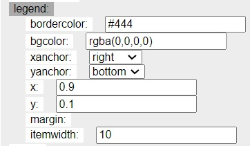
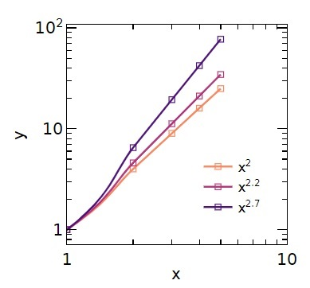

# Import Data

Create a csv or excel file with example data like the following. 

Now click on the *Choose File* button (alternatively drag and drop your file onto the button). The data will be plotted and should look like this: 

# Change the axis labels

Under the *Layout* section, click on *xaxis* the *title*. You should see this:

You can click on *xaxis* again to collapse the section. Repeat for the y axis.

# Set Legend

The legend is automatically shown, it can be toggled on/off with the *Showlegend* checkbox. Each data series is shown under the *Data* section on the right of the page. For now we just have the *y* series. Lets rename to *$x^2$*. Type this "x\2\"  into the *name*:

# Markers, Lines, or Markers and Lines

Lets show each datapoint and keep the line for this dataseries. Under *Data*, *mode* select the *lines+markers* from the dropdown.

# Resize Plot

Lets make this a rectangle. Under the *Layout* section, change the margins for the bottom, left, right and top and the total width and height of the plot as shown below:

# Line and Marker Styles 

Update the line style and the marker styles under the *Data* section as shown below: 

The plot should look like this: 

# Templates 

You can save this plotting style as a template by clicking on the *Save Template* button. The template is saved by your browser. Refresh the page and reupload the data to the *Choose File*  button. Under Choose Template click on the template you just saved. Your plot should go from the default formatting to include the styles we just set up.

# Multiple Data Series 

Create a csv or excel file with multiple data series formatted like such: 

Or if they all share the same x data: 

Upload this file as before. The default plot should look like this:

The data series styles can be adjusted individually as shown above. Alternatively, they can all be updated at the same time with the *Master Trace* style.  Here is an example and resulting plot: 

# Changing Colors

Just above the *Layout* button, the color scheme can be changed and the colors for each series are changed in accordance with their matching color in the color scheme. For example lets use the *tab20* scheme.   

It will look like this 

We can choose a sequential color scheme (the number of colors within the sequence is set by *n_colors*). Try *Viridis, Magma, Plasma,* etc. I will set as *Magma_r_* (reverse magma).

# Log scale 

Lets make this a log-log scale. We can do this by setting *type* to *log* for both *xaxis* and *yaxis*. As shown below I set the range from (0,1); note these are on the log scale. 

# Tick styles 

To only show the ticks every order of 1. Set *dtick* to 1 (again, this is logscale).  

# Moving the Legend

The legend can be moved with the *x* and *y* under the *Layout, legend*.  

If you made all the changes noted above, the plot should look like this:

# Export Plot

Within the plot region. Click on the button for either exporting as SVG or PNG:

SVG formatting is useful if you open in Inkscape to do any final formatting. PNG is useful for placing directly into a document. Note the PNG is upscaled 8 times to improve resolution; the actual size in pixels is the *width* and *height*  set in the *Layout* section.   